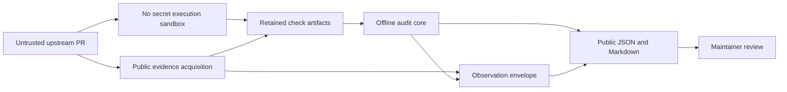

# Formal Conjectures PR audit threat model

## Executive summary

The audit core is intentionally a small offline transformer, but its expected deployment may be triggered automatically by an untrusted upstream pull request. The highest risks therefore sit outside the pure transformer: executing contributor-controlled Lean or helper code with credentials present, acquiring attacker-selected URLs, exhausting CI resources, and presenting unauthenticated mutable observations as authoritative. The current prototype already refuses network and process capabilities, bounds individual JSON files, rejects ambiguous paths and JSON, roots every retained input, and escapes its Markdown projection. Before automatic PR execution, the acquisition and proof-checking stages need a no-secret sandbox, URL policy, aggregate resource ceilings, and an authenticated observation receipt. Audit output remains advisory and all retained proof artifacts are intended to be public.

## Scope and assumptions

In scope:

- `scripts/pr_audit.py`, the deterministic core and observation-envelope library;
- `scripts/generate_pr_audit.py`, its CLI;
- `audit/pr-audit-v1/schemas/`, the machine contracts;
- `audit/pr-audit-v1/fixtures/` and `scripts/test_pr_audit.py`, the retained falsifiers;
- the future CI boundary that acquires public PR evidence and invokes this prototype automatically.

Out of scope:

- the security of GitHub, Lean, Lake, Comparator, and linked proof hosts themselves;
- Vela adapters, Repository signing, Decisions, and Standing;
- confidentiality of proof artifacts, which are public by design;
- FC maintainer authorization and merge policy.

Validated deployment assumptions:

- an upstream PR may automatically trigger the pipeline;
- PR source, metadata, comments, locators, and proof bytes are hostile input;
- all proof artifacts retained by this effort may be public;
- the untrusted execution job uses GitHub's `pull_request` event, a read-only `GITHUB_TOKEN`, no other secrets, and an ephemeral GitHub-hosted runner;
- no job with secrets or write permission checks out or executes the PR head, merge commit, uploaded artifact, build script, dependency hook, or generated code;
- acquisition and any Lean or Comparator execution run outside the deterministic core in an ephemeral, no-secret sandbox;
- the core receives only retained, bounded files and never fetches or executes them.

Open questions that would change the ranking:

- which separately protected CI identity and egress policy will attest acquisition without executing contributor code;
- whether FC will require approval before running especially expensive proof checks from first-time contributors.

The workflow must not substitute `pull_request_target` or a privileged `workflow_run` for the untrusted execution job. GitHub documents that fork `pull_request` runs receive a read-only token and no secrets, while `pull_request_target` receives the base repository's privileged token and secrets; checking out and executing the PR head in that privileged context is the documented “pwn request” pattern. See [Securely using `pull_request_target`](https://docs.github.com/en/actions/reference/security/securely-using-pull_request_target) and the [secure use reference](https://docs.github.com/en/actions/reference/security/secure-use).

## System model

### Primary components

- **Upstream event and acquisition stage.** A separately protected CI job observes a PR and retains exact public API responses, source blobs, and proof artifacts. It never executes contributor-controlled code and is not implemented by the offline core.
- **Execution sandbox.** A GitHub-hosted `pull_request` job may run native FC checks, Lean, or Comparator against contributor code with a read-only token and no other secrets. Its retained results become input artifacts.
- **Deterministic audit core.** `generate_core()` validates a complete manifest, exact digests, source identities, checks, and nonclaims, then emits a rooted immutable record (`scripts/pr_audit.py`).
- **Observation-envelope generator.** `generate_observation()` binds mutable GitHub state to a validated core without changing its root (`scripts/pr_audit.py`).
- **Human projection.** `render_markdown()` emits a deliberately small escaped view while JSON remains authoritative (`scripts/pr_audit.py`).

### Data flows and trust boundaries

- Internet and untrusted PR -> acquisition stage: public API JSON, Git blobs, proof locators, and public artifact bytes cross HTTPS. GitHub authentication and an explicit host/path policy are required; the protected stage must never execute bytes acquired from the PR. The prototype does not yet implement this stage.
- Acquisition stage -> retained input directory: exact bytes and acquisition metadata cross a filesystem boundary. Digests, complete file identity, safe paths, and public-only policy must be established before generation.
- Untrusted source -> execution sandbox: Lean source and proof projects cross into an executable boundary. The sandbox must have no credentials, no Repository authority, bounded CPU/memory/time/storage, and denied egress by default.
- Retained input directory -> deterministic core: bounded JSON and referenced regular files cross a local file boundary. Strict UTF-8/JSON parsing, digest validation, schema checks, traversal refusal, and symlink refusal are implemented.
- Deterministic core -> public artifacts: canonical JSON and an escaped Markdown view cross into public CI artifacts or review UI. Roots prove byte identity, not truth, authorization, or source authenticity.
- GitHub observation -> observation envelope: mutable review state crosses an authority-claim boundary. The current record binds retained bytes but still depends on the acquisition stage to prove that those bytes came from the named GitHub API.

#### Diagram

## Assets and security objectives

| Asset | Why it matters | Security objective |
|---|---|---|
| CI credentials and maintainer tokens | Theft could mutate upstream state or other repositories | C, I |
| CI runner and organization capacity | Hostile PRs can consume compute or block review | A |
| Audit core and input roots | Consumers rely on exact byte identity and deterministic replay | I, A |
| GitHub observation provenance | False review or merge status could mislead maintainers | I |
| Public audit artifacts | They must not accidentally publish credentials or private operator context | C, I |
| Authority nonclaims | A mechanical pass must not become acceptance, Decision, or truth | I |
| Generator implementation identity | Reproduction requires the exact code and schemas used | I, A |

## Attacker model

### Capabilities

- open or update an upstream pull request and control its source tree, filenames, metadata, comments, and outbound locators;
- submit syntactically valid but adversarial JSON or retained artifacts to any improperly exposed producer step;
- construct expensive Lean code, initializer behavior, large dependency graphs, redirect chains, misleading review text, and Markdown/HTML payloads;
- race mutable branch, review, and external-host state after an audit has run;
- observe all published audit and proof artifacts.

### Non-capabilities

- directly choose CLI arguments or output paths in a correctly fixed CI workflow;
- alter content-addressed retained bytes without changing their digest or record root;
- obtain a Vela Repository Decision or FC merge merely by producing an audit record;
- access secrets that are not mounted into the acquisition or execution jobs;
- make the offline core perform network or subprocess operations without changing its rooted implementation bytes.

## Entry points and attack surfaces

| Surface | How reached | Trust boundary | Notes | Evidence |
|---|---|---|---|---|
| Strict JSON parser | Every manifest and retained JSON artifact | retained files -> core | Rejects duplicate keys, floats, unsafe integers, malformed UTF-8, BOM, and lone surrogates; each file is capped at 2 MiB | `scripts/pr_audit.py` / `parse_json_bytes`, `MAX_INPUT_BYTES` |
| Manifest file resolver | Artifact paths in a core or observation manifest | retained directory -> filesystem | Refuses traversal, missing files, symlinks, non-regular files, and digest mismatch | `scripts/pr_audit.py` / `_read_regular_file`, `_load_manifest` |
| Check and repository validators | Retained repository and check objects | hostile records -> normalized core | Closed-key validation, exact base/head/blob identities, 64-artifact manifests, JSON depth 64, and a 100,000-item generic collection ceiling | `scripts/pr_audit.py` / `_validate_repository`, `_validate_check` |
| Observation source | Retained GitHub GraphQL-shaped document | mutable external state -> envelope | Core identity is cross-checked, but API authenticity is delegated to acquisition | `scripts/pr_audit.py` / `_validate_observation_source` |
| Markdown renderer | Evidence statements and witnesses | hostile text -> maintainer UI | Escapes HTML, pipes, and line breaks; the JSON remains authoritative | `scripts/pr_audit.py` / `render_markdown` |
| CLI output path | Operator or fixed workflow argument | core -> local filesystem | Safe only while PR data cannot control arguments or workspace layout | `scripts/generate_pr_audit.py` |
| Future source acquisition | Automatic PR event | Internet -> CI | Not implemented; must not inherit the core's “offline” trust claim | `audit/pr-audit-v1/README.md` / generator separation |
| Lean or Comparator execution | Automatic `pull_request` event | hostile code -> runner | Must be an ephemeral GitHub-hosted no-secret job with read-only token; contributor Lean can execute initializers during extraction | `scripts/pr_audit.py` module noncapabilities; execution-memo requirement; GitHub secure-use guidance |
| Privileged workflow boundary | Any `pull_request_target`, `workflow_run`, issue command, or protected acquisition job | hostile PR artifact -> privileged job | Must not check out, download and execute, source, import, or invoke contributor-controlled code | GitHub `pull_request_target` and secure-use guidance |

## Top abuse paths

1. A contributor adds hostile Lean initializer code -> a privileged acquisition job imports it -> the code reads a mounted token -> the attacker exfiltrates or uses upstream credentials.
2. A PR supplies a localhost, cloud-metadata, redirecting, or extremely large proof URL -> a permissive fetcher follows it -> internal data is exposed or the runner is exhausted.
3. A PR creates thousands of individually allowed artifacts -> each passes the 2 MiB per-file limit -> aggregate parsing, hashing, and storage consume the workflow budget and block other reviews.
4. A producer fabricates a GitHub-shaped observation JSON -> the envelope labels it `github_graphql` and roots it -> a consumer mistakes byte integrity for authenticated provenance.
5. A malicious evidence statement embeds markup or instruction text -> a projection renders it in a review surface -> a human or downstream agent follows attacker-authored instructions as policy.
6. A mutable branch or repository-root proof locator changes after audit -> a later reader fetches different bytes -> the displayed result no longer describes what the check evaluated.
7. A mechanical pass and successful upstream status are combined into a “clean” label -> a maintainer or adapter treats it as semantic fidelity or acceptance -> incorrect scientific meaning propagates.
8. A fixed CI script permits PR-controlled output paths or symlinked workspaces -> generation overwrites another workspace file or signs the wrong artifact.

## Threat model table

| Threat ID | Threat source | Prerequisites | Threat action | Impact | Impacted assets | Existing controls | Gaps | Recommended mitigations | Detection ideas | Likelihood | Impact severity | Priority |
|---|---|---|---|---|---|---|---|---|---|---|---|---|
| TM-001 | Malicious PR author | Automatic workflow executes contributor code with secrets or broad host access | Exfiltrate a token or mutate the runner during Lean/extractor initialization | Upstream mutation, credential theft, runner compromise | CI credentials, repository integrity | Offline core imports no execution/network adapters and declares noncapabilities (`scripts/pr_audit.py`); deployment contract selects `pull_request`, read-only token, no secrets, and GitHub-hosted runner | Exact workflow and sandbox controls are not yet implemented | Split acquisition and execution jobs; never execute PR code from `pull_request_target`, `workflow_run`, or another privileged job; set explicit read-only permissions; mount no secrets; pin every third-party GitHub Action to its full immutable commit SHA; use ephemeral runner/container, read-only inputs, denied egress, non-root user, syscall/capability restrictions, and explicit CPU/memory/time/storage ceilings | Assert event name, token permissions, secret absence, full-SHA Action pins, and hosted-runner label; alert on outbound connections, killed resource limits, unexpected child processes, and workspace writes | high | high | critical |
| TM-002 | Malicious PR author | Future acquisition accepts attacker-selected URLs | Use redirects or special addresses for SSRF, or fetch an unbounded response | Internal-data exposure and CI exhaustion | Runner environment, CI availability | Core performs no network access | Acquisition URL/redirect policy is not implemented | Allowlist HTTPS hosts and immutable path forms; resolve and reject private/link-local/loopback addresses on every redirect; cap redirects, bytes, and time; store exact final URL and response digest | Log normalized destination class and refusal code without tokens; alert on private-address attempts | high | high | high |
| TM-003 | Malicious artifact producer | Can supply many individually bounded artifacts | Exhaust memory, CPU, disk, or logs through aggregate input volume or pathological nesting | Review pipeline denial of service | CI availability | 2 MiB per-file cap, 64-artifact manifest cap, JSON depth 64, collection-size cap 100,000, safe integers, and strict parser (`MAX_INPUT_BYTES`, `MAX_MANIFEST_ARTIFACTS`, `MAX_JSON_DEPTH`, `MAX_CONTAINER_ITEMS`, `parse_json_bytes`) | No explicit aggregate-byte, string-length, check/evidence/proof-count, or output-size ceiling | Add aggregate-byte limits before reading; cap total strings, checks, evidence, proofs, and generated output; enforce workflow timeout | Emit bounded refusal metrics by reason; alert on repeated quota failures per actor/PR | high | medium | high |
| TM-004 | Compromised or buggy acquisition producer | Can write retained observation bytes | Fabricate mutable GitHub status that is internally well-formed and rooted | Maintainers see false approval, merge, or check state | Observation provenance, reviewer trust | Envelope is separate from core and cross-checks PR/base/head (`_validate_observation_source`) | `authority: github_graphql` is asserted from document shape, not authenticated receipt | Retain request endpoint, repository, authenticated actor/app identity, response headers/event delivery id, acquisition implementation root, and raw response digest; sign/attest the acquisition receipt or run it in a protected workflow | Compare envelope against live API in dry-run; alert on source-receipt mismatch and impossible state transitions | medium | high | high |
| TM-005 | Malicious PR author | Mutable or ambiguous proof locator is accepted | Change referenced proof bytes after the check or make multiple targets plausible | Replay no longer evaluates the same evidence | Audit integrity, reproducibility | Exact retained artifacts and roots are required; mutable/ambiguous identities can be `unavailable` | Future fetcher could still accept branch/repository landing pages | Require immutable commit plus exact file/blob and content digest for evaluated artifacts; retain bytes when licensing permits; keep unresolved identity distinct from failure | Periodically replay retained fixture roots; reject locator drift in CI | high | medium | high |
| TM-006 | Malicious PR text or prompt injection | Human/agent consumes projection | Smuggle HTML, Markdown, or imperative text into an audit view | Misleading UI or downstream agent action | Maintainer attention, process integrity | Renderer escapes HTML, pipe, CR/LF; output is explicitly advisory (`render_markdown`) | Prompt text remains semantically untrusted; other future projections may diverge | Treat all evidence as quoted data; use inert code/text containers; apply the same escaping fixture to every projection; never concatenate source text into agent/system instructions | Snapshot hostile fixtures; CSP and DOM sanitizer alarms in web consumers | high | medium | high |
| TM-007 | Buggy consumer or producer | Scalar disposition is consumed without nonclaims | Collapse pass into fidelity, merge, Decision, or Standing | Incorrect governance or scientific-state transition | Authority separation | Core disposition is derived; clean requires independent human semantic pass; fixed nonclaims are validated (`_disposition`, `validate_core`) | Labels can still overclaim before ground truth; external consumers are not yet tested | Keep candidate/pending labels machine-distinct; publish a do-not-collapse conformance fixture; adapters must refuse FC `unavailable` as a Vela Verification outcome | Contract tests in every consumer; scan UI and exports for prohibited authority vocabulary | medium | high | high |
| TM-008 | Local filesystem attacker or concurrent job | Can mutate the retained directory during validation | Swap a checked file between `lstat`, resolve, stat, and read | Digest or type checks apply to different filesystem states | Core input integrity | Traversal and symlinks are refused; digest is checked after read (`_read_regular_file`, `_load_manifest`) | Path resolution is not an atomic open; shared mutable workspace assumption is implicit | Use an isolated immutable workspace; open with directory file descriptors and `O_NOFOLLOW`; `fstat` the opened descriptor; hash the bytes read from that descriptor | Fail on workspace mutation; audit inode/device metadata in debug logs | low | high | medium |
| TM-009 | PR author or accidental source content | Public artifact contains a credential or personal datum | Cause public audit output to retain sensitive text | Secret/PII disclosure | Public artifacts | User confirmed proof artifacts are public; core holds no credentials by design | Public PR text can still accidentally contain secrets; evidence is copied verbatim | Mount no secrets; allowlist acquired fields; run secret/PII detection before publication and quarantine rather than silently rewrite exact bytes; separate private incident evidence if ever needed | Secret scanning on retained/public outputs; revoke on confirmed exposure | low | high | medium |
| TM-010 | PR-controlled workflow data | Workflow lets input select CLI paths | Overwrite arbitrary workspace files or place sidecars in a trusted location | Build/release integrity compromise | Workspace and generated artifacts | CLI paths are operator arguments, not record fields (`scripts/generate_pr_audit.py`) | Future CI invocation contract is not frozen | Use constant output directories created with restrictive permissions; refuse existing/symlink outputs; publish only an explicit artifact allowlist | Assert clean worktree and exact output inventory after generation | low | medium | low |

## Criticality calibration

- **Critical:** credible compromise of an upstream maintainer credential or CI host from an ordinary PR; arbitrary upstream mutation; running hostile contributor code beside Repository-authority or signing credentials.
- **High:** falsified audit provenance or systematic authority collapse that can mislead merge/review decisions; reliable organization-level CI denial; SSRF into sensitive runner services.
- **Medium:** bounded single-run denial, public leakage of accidentally supplied sensitive text, filesystem races requiring local co-residency, or misleading projections that existing nonclaims substantially contain.
- **Low:** operator-only output-path misuse in a fixed ephemeral job, cosmetic projection injection already escaped, or noisy failures with no authority, secret, or durable-state effect.

## Focus paths for security review

| Path | Why it matters | Related Threat IDs |
|---|---|---|
| `scripts/pr_audit.py` | Owns parsing, canonicalization, filesystem resolution, schema enforcement, disposition, and rendering | TM-003, TM-005, TM-006, TM-007, TM-008 |
| `scripts/generate_pr_audit.py` | Owns operator arguments and generated output paths | TM-010 |
| `scripts/test_pr_audit.py` | Must retain hostile-input, determinism, path, nonclaim, and availability falsifiers | TM-003, TM-005, TM-006, TM-007, TM-008 |
| `audit/pr-audit-v1/schemas/` | Closed contracts determine what consumers may trust | TM-004, TM-007 |
| `audit/pr-audit-v1/fixtures/` | Frozen adversarial cases can either prevent or institutionalize false ground truth | TM-004, TM-005, TM-007 |
| `.github/workflows/` | Future automatic trigger, permissions, sandbox, egress, quotas, and artifact publication live here | TM-001, TM-002, TM-003, TM-009, TM-010 |
| `scripts/extract_names.lean` | Importing contributor Lean can execute initializers and must never happen in the pure/no-secret stage | TM-001 |

## Quality check

- Covered the CLI parser, manifest resolver, validators, observation path, renderer, future acquisition, and executable proof-checking entry points.
- Represented Internet, filesystem, execution-sandbox, mutable-observation, and public-output trust boundaries in the threats.
- Kept the offline runtime distinct from future CI acquisition/execution and from fixtures/tests.
- Incorporated the user's confirmation that upstream PR automation is expected and all proof artifacts may be public.
- Left CI identity/egress and first-time-contributor execution policy as explicit implementation questions.
