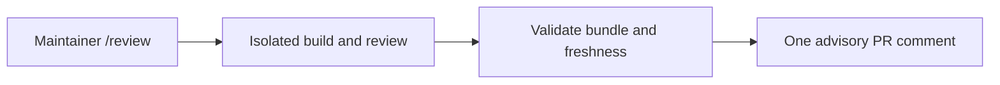

# Opt-in Actions pilot

This workflow depends on #4899. It remains disabled until FC maintainers configure it.
There is no GitHub App or archive repository.
The PR integration job tests against #4899 at a pinned commit; ordinary script discovery
explicitly skips these dependent tests until those tools exist on main. Remove the extra
checkout after #4899 merges.



- **Trigger:** an exact `/review` comment from someone with current write, maintain or admin
  permission. Jobs use the default-branch workflow and tooling, never PR workflow code.
- **Execution:** the independent build and model scratch commands use different containers.
  Neither receives credentials, networking, writable host files or the Docker socket.
  The host controller alone calls the model API. Model output cannot supply the build receipt.
- **Publication:** a separate job validates the request ticket, report digest and complete bundle
  against the same run and attempt, then reassembles it before updating one bot comment.
  It checks the current PR head, base tip and tooling commit before publishing. Freshness is
  an observation at publication, not a promise about future pushes; always compare the SHA.
- **Retention:** complete bundles and raw execution records are Actions artifacts for 30 days.
  Download them before expiry if needed. Missing or failed execution produces no success
  report. The Actions run retains the failure. No durable retention is claimed.

## Maintainer setup

1. Configure the protected `fc-review-pilot` GitHub environment and its approval policy.
2. Supply its `FC_REVIEW_API_KEY` secret and set an explicit API project spending limit.
   Set `FC_REVIEW_MODEL` to an available model supporting Responses structured output and
   function calls. The development evals used GPT-5.6 Sol through Codex; API availability
   must be checked independently. No alternative model is silently substituted.
3. Set `FC_REVIEW_IMAGE` to a public reviewed Linux image **by registry digest**. It must have
   `lake`, `lean`, `sh`, `timeout`, ordinary file tools and an exact cache under
   `/opt/review-cache/.lake`, with `lean-toolchain`, `lake-manifest.json` and `lakefile.toml`
   beside it. The cache must use the same pinned dependencies and contain no credentials.
   Dependency packages stay read-only in the image; only the FC build cache is copied.
   Source/cache drift is rejected before execution. The image build and maintenance belong
   to the FC operators; this PR does not deploy or publish an image.
4. Set `FC_REVIEW_ENABLED=true` only after a disposable pilot PR has exercised the complete
   hosted workflow. Each model review is limited to 20 tool calls, seven minutes and 8,000
   output tokens per response; these bounds are not a currency budget.

The initial scope is at most five existing problem modules. Configuration, utility, deleted
or broader changes stop explicitly and need ordinary review. This pilot has no source-fetch
service; absent cited sources leave source fidelity incomplete. It runs fresh reviews only;
use the local report tool for contested rereviews with retained context. It does not execute
external proofs, Comparator, downstream admissions or acceptance decisions.

The workflow is a bounded integration pilot, not a claim of production qualification. Hosted
activation, model access, image maintenance and budget ownership remain maintainer decisions.

Build the cache from a reviewed revision using the existing evaluation Dockerfile, then
adapt its filesystem layout with this small Dockerfile (do not build it from PR code):

```sh
docker build --build-arg FC_REV=REVIEWED_COMMIT -f scripts/review-eval/Dockerfile -t fc-review-cache .
docker build --build-arg REVIEW_EVAL_IMAGE=fc-review-cache -f scripts/review-report/Dockerfile -t fc-review-pilot .
```

Push the reviewed image through the operator's normal registry process and configure its
returned registry digest. The resulting image digest pins the fetched build dependencies;
the Docker build itself is not claimed to be reproducible.
