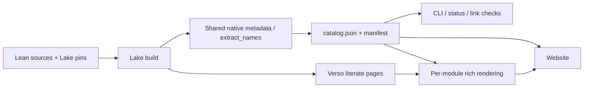

# (work-in-progress) formal-conjectures-website

**THIS IS EXPERIMENTAL FOR NOW**

Features to add:

- form to allow contribution suggestions
- conjecture upvoting system?

Website for the [Formal Conjectures](https://github.com/google-deepmind/formal-conjectures) Lean 4 repository.

## Architecture

The existing Lake build produces one native catalog and Verso's rendered source
pages. The website and CLI read the same catalog. See [the data contract](API.md)
for endpoints, schemas, snapshot verification, and provenance.



CI builds `FormalConjecturesAnswerPostpone`, runs `extract_names`, and validates
its complete output with `scripts/publish_catalog.py`. This preserves the native
schema-2 fields and records the exact source and extractor revisions, toolchain,
and dependency digest. `extract_names` arguments, ordering, and field meanings
are unchanged. Anonymous examples remain excluded; no identities are invented.

`node build.js` copies the canonical catalog without rewriting its bytes. A shared
JavaScript adapter supplies display labels in memory and during static rendering.
There is no second published `data/conjectures.json` projection.

Verso supplies formatted docstrings, highlighted code, and hovers. The fragment
step retains only catalog declarations and their referenced hover records. The
build writes these into per-module rendering files, bound to the catalog digest.
Opening a problem loads its module, without downloading corpus-wide rendering or
hover data. The full annotated source pages remain under `/src/`.

File-level contributors come from git history at the catalog source revision.
GitHub profile enrichment is optional. Website-only previews reuse the published
catalog and its matching rendered modules; they do not recompute contributor
history or relabel the data as belonging to the preview branch.

Catalog integrity errors stop the build or browsing operation. Missing rich
rendering is shown explicitly; the native statement remains readable. Missing
optional evidence or queue feeds are also visible and do not change catalog facts.
The first deployment must run the full build. Preview downloads and default CLI
browsing require that deployment; no older projection substitutes for it.

## Repository layout

```
data/
  catalog.json            # Complete native catalog with exact provenance
  catalog-manifest.json   # Byte digest, count, and schema reference
  verso-fragments.json    # Build intermediate; never published
src/
  css/style.css           # Stylesheet (CSS custom properties throughout)
  js/
    main.js               # Shared utilities loaded on every page
    browse.js             # Filter/search/paginate logic for /browse/
    theorem.js            # Theorem detail rendering for /theorem/
  templates/
    index.html            # Landing page template (stats injected by build.js)
    browse.html           # Browse page (client-side filtering)
    theorem.html          # Theorem detail page (client-side, reads ?name= param)
    contribute.html       # How-to-contribute page (static)
    about.html            # About page (static)
build.js                  # Build script — reads data/, writes site/
package.json
.github/workflows/
  deploy.yml              # CI: build + deploy to GitHub Pages
```

The `site/` output directory is generated by the build script and is not committed (it is in `.gitignore`).

## Pages

| URL                               | Description                                            |
| --------------------------------- | ------------------------------------------------------ |
| `/`                               | Landing page: stats, browse by source and AMS subject  |
| `/browse/`                        | Filterable, searchable, paginated list of all theorems |
| `/theorem/?name=<full.lean.name>` | Detail page for an individual theorem                  |
| `/contribute/`                    | Contribution guide                                     |
| `/about/`                         | About the project                                      |

Individual theorem pages are rendered client-side from `data/catalog.json` — no separate HTML file is generated per theorem.

Lean code uses Verso's existing tokens and hover information. The shared theme,
`src/css/lean-syntax.css`, maps VS Code Light+ colors to Verso's CSS variables
and token classes.

Our `verso-html` renderer accepts only input and output directories, so
`fix_literate_html.py` installs the stylesheet in generated source pages.
Theorem excerpts load the same stylesheet from the website assets. Run the
post-processor again after changing the theme to refresh source previews.

## Building locally

After the native catalog is deployed, `dev.sh` downloads the complete catalog
from the production site (no Lean build needed):

**Requirements:** Node.js 18+ and Python 3.

```bash
# Install Node.js if needed (e.g. via conda)
conda install -c conda-forge nodejs

# Build and serve
cd site
./dev.sh              # build + serve on http://localhost:8080
./dev.sh --build-only # just build, no server
./dev.sh --port 3000  # serve on a custom port
```

To iterate on templates or styles, re-run `./dev.sh --build-only` after each change
and refresh the browser.

### Building with fresh data from a local Lean build

For a full local build, commit the source and dependency changes first. Use your
own repository below when building fork changes:

```bash
# In the formal-conjectures repo root
lake exe cache get   # download prebuilt Mathlib oleans (first time only)
lake --wfail build FormalConjecturesAnswerPostpone
mkdir -p site/data
lake exe extract_names --exclude=fileFirstAdded,fileLastModified > /tmp/fc-native-extract.json
python3 scripts/publish_catalog.py /tmp/fc-native-extract.json --repository google-deepmind/formal-conjectures --out site/data

# Generate Verso literate fragments from the same committed source.
# Warning: the literate build step can take a long time (30+ minutes).
cd docbuild
lake build FormalConjectures:literate FormalConjecturesForMathlib:literate FormalConjecturesUtil:literate
lake exe verso-html .lake/build/literate ../_literate_html
cd ..
python3 site/fix_literate_html.py _literate_html
python3 site/extract_verso_fragments.py _literate_html site/data/verso-fragments.json --catalog-dir site/data

# Build the site
cd site
node build.js        # output goes to site/

# Serve locally
python3 -m http.server 8080 --directory site
```

## Developing on a fork (sharing a live preview)

To share a live preview of your website changes with others, you can deploy from
a **`*-webtest`** branch on your GitHub fork. The CI workflow detects this naming
convention and **skips the slow Lean build**, downloading data from the live
production site instead.

### One-time fork setup

1. **Fork** the repository on GitHub.

2. **Enable GitHub Pages:**
   - Go to your fork's **Settings → Pages**
   - Set **Source** to **GitHub Actions**

3. **Allow webtest branches to deploy:**
   - Go to **Settings → Environments → `github-pages`**
   - Under **Deployment branches and tags**, click **Add deployment branch or tag rule**
   - Add the pattern **`*-webtest`**
   - Save

### Development workflow

```bash
# Create a webtest branch from main
git checkout -b my-feature-webtest origin/main

# Make your website changes (CSS, JS, templates, etc.)
# ...

# Push to your fork — CI builds and deploys automatically
git push <your-fork> my-feature-webtest
```

Your site will be live at `https://<username>.github.io/formal-conjectures/`
once the Action completes (typically ~2 minutes for a website-only build).

> **Note:** The naming convention `*-webtest` is what triggers the fast
> website-only build. Branches without this suffix run the full Lean build.

> **Note:** GitHub Pages serves one deployment at a time per repo. Deploying
> from a webtest branch replaces what was deployed from `main`. This is fine
> for a fork used for previewing.


## CI / deployment

The GitHub Actions workflow in `.github/workflows/build-and-docs.yml` triggers on pushes to `main` and `*-webtest` branches, as well as on pull requests.

**Build modes:**

| Condition | Build mode | What happens |
|-----------|-----------|--------------|
| Push to `main` on upstream | Full build | Lean compilation + docs + website |
| Push to `*-webtest` branch | Website-only | Downloads live data, builds website only (~2 min) |
| Manual `workflow_dispatch` with `website_only=true` | Website-only | Same as above |
| Pull request | Full build | Lean compilation + docs + website (no deploy) |

**Deployment** happens on pushes to `main`, and on `*-webtest` branches when on a fork.

For GitHub Pages setup (including the environment rule needed for `*-webtest` branches), see [One-time fork setup](#one-time-fork-setup) above.
